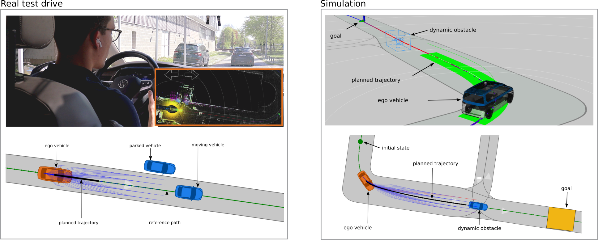

# CommonRoad-Autoware Motion Planning Interface (CR2AW)

This project builds an interface between [CommonRoad](https://commonroad.in.tum.de/) and [Autoware.Universe](https://github.com/autowarefoundation/autoware.universe).
This enables to use various motion planners using the CommonRoad format within the Autoware software stack and rapidly transfer
new algorithms from simulation to a real vehicle.

**CR2AW** is implemented as a ROS2 node which can be launched as a complete planning module within Autoware.
This repository provides the source code, as well as the required launch and dependency files to run the CommonRoad planning
module in Autoware.



## :bookmark_tabs: Table of Contents

- [Table of Contents](#bookmark_tabs-table-of-contents)
- [File structure](#file_folder-repository-structure)
- [Requirements and Dependencies](#link-requirements-and-dependencies)
- [Setup](#wrench-setup)
- [Launch](#rocket-launch-and-usage)
- [Development Guide](#hammer-development-guide)
- [Authors](#busts_in_silhouette-authors)
- [Citation](#speech_balloon-citation)

## :file_folder: Repository structure

Below, we provide a basic overview over the most important components of the  repository. 
For a detailed explanation of the software architecture, please see our [paper](#speech_balloon-citation).

```tree
.
├── cr2autoware/
│   ├── cr2autoware.py                        # CR2AW interface ROS2 node
│   ├── common
│   │   ├── ros_interface/                    # ROS publisher/subscriber specifications
│   │   └── utils/                            # utilities
│   ├── handlers/                             # implementation of handler classes
│   ├── interfaces/
│   │   ├── base/                             # base interface classes 
│   │   └── implementation/                   # implementation of interface classes
│   │
├── data                                      # directory to store sample CommonRoad map
├── launch
│   └── cr2autoware_node.launch.xml           # launch file for CR2AW node
├── param
│   ├── cr2autoware_param_file.param.yaml     # ROS param file for the CR2AW node
│   └── edgar_rp_config.yaml                  # config parameters for the reactive planner
├── scripts
│   ├── lanelet2cr.py                         # conversion script for a Lanelet2 map to CR format
│   └── cr2lanelet.py                         # conversion script for a CR map to Lanelet2 format
│
├── tum_commonroad_planning_launch/           # ROS launch package for the CommonRoad planning component
│   ├── launch/                               # launch file
│   ├── config/                               # ROS param files
│
├── tum.commonroad.planning.repos             # Dependencies pulled via VCS
├── cr2autoware_install.sh                    # Setup bash sript for CR2AW node
.
```

## :link: Requirements and Dependencies

### System requirements

**CR2AW** runs together with Autoware: the minimum system requirements for running Autoware are described 
[here](https://autowarefoundation.github.io/autoware-documentation/main/installation/).
We recommend running Autoware within a dockerized setup.

### Dependencies

#### Autoware

**CR2AW was tested with Autoware version with release tag 2023.06, which is accessible [here](https://github.com/autowarefoundation/autoware/tree/release/2023.06).**

_Note: We can not guarantee that CR2AW works with other versions of Autoware at this point. However, regular updates to 
new  Autoware releases will follow soon._


#### CommonRoad
The pip dependencies of CR2AW are listed in the requirements file `requirements.txt`.

The following CommonRoad dependencies are pulled from GitHub. They are included in the `tum.commonroad.planning.repos`
file and are pulled via VCS (see [Setup](#wrench-setup)).

| Tools                            | Version                                  |
| -------------------------------- | ----------------------------------------- |
| [commonroad-scenario-designer](https://github.com/CommonRoad/commonroad-scenario-designer)     | develop:latest                         |
| [commonroad-reactive-planner](https://github.com/CommonRoad/commonroad-reactive-planner)       | master:latest                          |


## :wrench: Setup

To setup Autoware, we recommend using the [Docker Installation Setup](https://autowarefoundation.github.io/autoware-documentation/main/installation/autoware/docker-installation/),
which is described in detail on the Autoware Documentation page. Our interface can be directly integrated into the setup procedure.

Following the Docker Installation Setup there are two setup options for Autoware: using **pre-built Docker images** or **building the Docker image from scratch**.
You can use both options for CR2AW, simply make sure to use the Autoware release tag mentioned above (see [here](https://autowarefoundation.github.io/autoware-documentation/main/installation/autoware/docker-installation/#using-docker-images-other-than-latest))
and use images with the `devel` tag.

After setting up a working Autoware Docker on your machine, you need to run the following steps to include CR2AW within your Docker container:
1. Go to `autoware` root directory: `cd autoware/`
2. Copy the file: `tum.commonroad.planning.repos` into `autoware/`
3. Pull dependencies via vcs
   ```shell
   vcs import src < tum.commonroad.planning.repos
   ```
4. Go to root directory of `commonroad-autoware-interface/`
   ```shell
   cd src/universe/autoware.universe/planning/tum_commonroad_planning/commonroad-autoware-interface/
   ```
5. Run setup bash script for CR2AW. This installs all CommonRoad-related dependencies
    ```shell
   ./cr2autoware_install.sh
   ```
6. Go back to `autoware` root directory
7. Build the ROS packages for CR2AW and for the CommonRoad planning module launch via `colcon`
   ```shell
   colcon build --symlink-install --packages-select cr2autoware tum_planning_launch
   ```
8. Source the install workspace
   ```shell
   source install/setup.bash
   ```

_Note (only for TUM internal setup): For setup guide using a microservice architecture (i.e., docker compose launch), where 
individual modules run in their own docker containers, please refer to `README_FOR_DEVELOPERS.md`_

## :rocket: Launch and Usage

The **CR2AW** interface integrates into the standard launch procedure of the Autoware and has been tested both
with the _Planning Simulation_ of Autoware and by running Autoware on our real vehicle [EDGAR](https://arxiv.org/pdf/2309.15492).
Here we describe how to launch **CR2AW** with Autoware's _Planning Simulation_.

A tutorial on how to use the _Planning Simulation_ of Autoware is provided [here](https://autowarefoundation.github.io/autoware-documentation/main/tutorials/ad-hoc-simulation/planning-simulation/#placing-dummy-objects).
Please make sure that you have gone through this tutorial beforehand and are able to use the standard Autoware version 
with the _Planning Simulation_.

To replace the Autoware planning module by **CR2AW** and use a CommonRoad planner, the following steps should be performed.

### Map conversion
Autoware requires an HD map in the Lanelet2 format. Any custom Lanelet2 map can be used with Autoware, as described [here](https://autowarefoundation.github.io/autoware-documentation/main/tutorials/ad-hoc-simulation/planning-simulation/#want-to-try-autoware-with-your-custom-map).
For **CR2AW**, we require the map in the CommonRoad format. Thus, we use the Lanelet2-CommonRoad map conversion from 
the [CommonRoad-Scenario-Designer](https://commonroad.in.tum.de/tools/scenario-designer). 
We provide a script for the map conversion in `./src/cr2autoware/scripts/lanelet2cr.py`

1. Change input path your map directory which contains

    a) The lanelet2 map as a `*.osm` file
    
    b) A map configuration file `map_config.yaml` which specifies the lat/lon map origin of the lanelet2 map. 
       **Important: The lat/long origin must correspond to the origin coordinates of the associated MGRS grid cell in which
       your map is located.** Currently, only maps which lie within one MGRS grid cell can be used with Autoware.

2. Run the conversion script

3. Check if the CommonRoad map (`*.xml` file) is in the map directory

In `/src/cr2autoware/data/sample-map-planning/` we provide the converted map and the `map_config.yaml` for the sample-map-planning used in the Autoware tutorials.

### Launch CommonRoad Planning module
Launching the CommonRoad Planning module within the _Planning Simulation_ is done similarly to the instructions in the Autoware 
[Tutorial](https://autowarefoundation.github.io/autoware-documentation/main/tutorials/ad-hoc-simulation/planning-simulation/#lane-driving-scenario).
_Note: all steps are performed within the Docker container running Autoware (unless you use a local installation of Autoware).
We further assume that the `autoware/` directory is located in the home directory `~`._

1. Source the workspace:
   ```shell
   source ~/autoware/install/setup.bash
   ```
   
2. Launch the planning simulation. We use the launch file `planning_simulator.launch.xml` provided in `tum_commonroad_planning_launch/launch`
   where we deactivate the default Autoware planning module.
   ```shell
   ros2 launch tum_planning_launch planning_simulator.launch.xml map_path:=<YOUR_MAP_PATH> vehicle_model:=sample_vehicle sensor_model:=sample_sensor_kit
   ```
   where you replace `<YOUR_MAP_PATH>` accordingly. 

3. Launch the CommonRoad planning module and CR2AW:
   ```shell
   ros2 launch tum_planning_launch tum_planning_component.launch.xml map_path:=<YOUR_MAP_PATH> vehicle_model:=sample_vehicle
   ```
   where you replace `<YOUR_MAP_PATH>` accordingly.


## :hammer: Development guide

Please see our `README_FOR_DEVELOPERS.md` for some additional notes on how to use CR2AW for development purposes.

## :busts_in_silhouette: Authors

**In alphabethic order by last name:**

**Maintainers**: Yuanfei Lin, Tobias Mascetta, Gerald Würsching

**Contributors**: Hamza Begic, Hamza Ben Yaacoub, Aziz Bouziri, Andrii Chumak, Jan Franck, Till Grutschus, Koray Koca, Yuanfei Lin,
              Tobias Mascetta, Kaian Ni, Wei-Lin Pai, Sven Pflaumbaum, Florian Weiser, Gerald Würsching, Yashuai Yan, Alexander Zimmer


## :speech_balloon: Citation
**If you use our code for research, please cite our [paper](https://mediatum.ub.tum.de/doc/1740269/h9fhalm4tfqbb9abjpd33gwpc.pdf):**

```
@inproceedings{Wuersching2024b
  author = {Würsching, Gerald and Mascetta, Tobias and Lin, Yuanfei and Althoff, Matthias},
  title = {Simplifying Sim-to-Real Transfer in Autonomous Driving: Coupling Autoware with the CommonRoad Motion Planning Framework},
  booktitle = {Proc. of the IEEE Intelligent Vehicles Symposium},
  year={2024},
  pages = {tbd},
  abstract = {Validating motion planning algorithms for autonomous vehicles on a real system is essential to improve their safety in 
              the real world. Open-source initiatives, such as Autoware, provide a deployable software stack for real vehicles. 
              However, such driving stacks have a high entry barrier, so that integrating new algorithms is tedious. Especially new 
              research results are thus mostly evaluated only in simulation, e.g., within the CommonRoad benchmark suite. To address 
              this problem, we present CR2AW, a publicly available interface between the CommonRoad framework and Autoware. CR2AW 
              significantly simplifies the sim-to-real transfer of motion planning research, by allowing users to easily integrate 
              their CommonRoad planning modules into Autoware. Our experiments both in simulation and on our research vehicle showcase 
              the usefulness of CR2AW.},
}
```