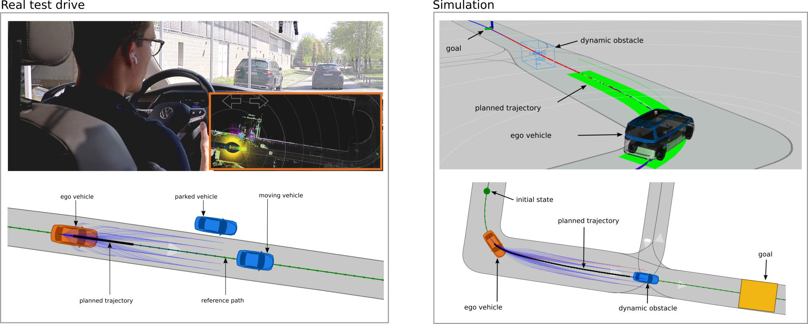

# CommonRoad-Autoware Behavior and Motion Planning Interface

This project builds an interface between [CommonRoad](https://commonroad.in.tum.de/) and [Autoware.Universe](https://github.com/autowarefoundation/autoware.universe) and expands the previous CR2AW package with behavior planning capabilities.
CR2AW-2.0 enables enables the modeling, orchestration and sim-to-real transfer of high-level behavior using finite state machines from statecharts and low-level behavior using behavior trees.

**CR2AW** is implemented as a ROS2 node which can be launched as a complete planning module within Autoware.
This repository provides the source code, as well as the required launch and dependency files to run the CommonRoad planning
module in Autoware.




### System requirements

**CR2AW** runs together with Autoware: the minimum system requirements for running Autoware are described 
[here](https://autowarefoundation.github.io/autoware-documentation/main/installation/).
We recommend running Autoware within a dockerized setup.

### Dependencies

#### Autoware

**CR2AW was tested with Autoware.Universe version with release tag v1.0, which is accessible [here](https://github.com/autowarefoundation/autoware.universe/tree/v1.0).**

_Note: Updates to newer  Autoware releases will follow regularly._


#### CommonRoad
The pip dependencies of CR2AW are listed in the requirements file `requirements.txt`.

The following CommonRoad dependencies are pulled from GitHub. They are included in the `tum.commonroad.planning.repos`
file and are pulled via VCS (see [Setup](#wrench-setup)).

| Tools                            | Version                                  |
| -------------------------------- | ----------------------------------------- |
| [commonroad-scenario-designer](https://github.com/CommonRoad/commonroad-scenario-designer)     | develop:latest                         |
| [commonroad-reactive-planner](https://github.com/CommonRoad/commonroad-reactive-planner)       | master:latest                          |


## :wrench: Setup

To setup Autoware, we recommend using the [Docker Installation Setup](https://autowarefoundation.github.io/autoware-documentation/main/installation/autoware/docker-installation/),
which is described in detail on the Autoware Documentation page. Our interface can be directly integrated into the setup procedure.

Following the Docker Installation Setup there are two setup options for Autoware: using **pre-built Docker images** or **building the Docker image from scratch**.
You can use both options for CR2AW, simply make sure to use the Autoware release tag mentioned above (see [here](https://autowarefoundation.github.io/autoware-documentation/main/installation/autoware/docker-installation/#using-docker-images-other-than-latest))
and use images with the `devel` tag.

After setting up a working Autoware Docker on your machine, you need to run the following steps to include CR2AW within your Docker container:
1. Go to `autoware` root directory: `cd autoware/`
2. Copy the file: `tum.commonroad.planning.repos` into `autoware/`
3. Pull dependencies via vcs
   ```shell
   vcs import src < tum.commonroad.planning.repos
   ```
4. Go to root directory of `commonroad-autoware-interface/`
   ```shell
   cd src/universe/autoware.universe/planning/tum_commonroad_planning/commonroad-autoware-interface/
   ```
5. Run setup bash script for CR2AW. This installs all CommonRoad-related dependencies
    ```shell
   ./cr2autoware_install.sh
   ```
6. Go back to `autoware` root directory
7. Build the ROS packages for CR2AW and for the CommonRoad planning module launch via `colcon`
   ```shell
   colcon build --symlink-install --packages-select cr2autoware tum_planning_launch
   ```
8. Source the install workspace
   ```shell
   source install/setup.bash
   ```

_Note (only for TUM internal setup): For setup guide using a microservice architecture (i.e., docker compose launch), where 
individual modules run in their own docker containers, please refer to `README_FOR_DEVELOPERS.md`_

## :rocket: Launch and Usage

The **CR2AW** interface integrates into the standard launch procedure of Autoware and has been tested both
with the _Planning Simulation_ of Autoware and on our real vehicle [EDGAR](https://arxiv.org/pdf/2309.15492).
Here we only describe how to launch **CR2AW** with Autoware's _Planning Simulation_.

A tutorial on how to use the _Planning Simulation_ of Autoware is provided [here](https://autowarefoundation.github.io/autoware-documentation/main/tutorials/ad-hoc-simulation/planning-simulation/#placing-dummy-objects).
Please make sure that you have gone through this tutorial beforehand.

To replace the standard Autoware planning module by **CR2AW**, the following steps should be performed.

### Map conversion
Autoware requires an HD map in the _Lanelet2_ format (see [here](https://autowarefoundation.github.io/autoware-documentation/main/tutorials/ad-hoc-simulation/planning-simulation/#want-to-try-autoware-with-your-custom-map)).
For **CR2AW**, we require the map in the _CommonRoad_ format. Thus, we use the Lanelet2-CommonRoad map conversion from 
the [CommonRoad-Scenario-Designer](https://commonroad.in.tum.de/tools/scenario-designer). 
We provide a script for the map conversion in `./src/cr2autoware/scripts/lanelet2cr.py`

1. Change input path in `lanelet2cr.py` to your map directory which contains

    a) The lanelet2 map (`*.osm` file)
    
    b) A map configuration file `map_config.yaml` which specifies the lat/lon map origin of the lanelet2 map. 
       **Important: The lat/long origin must correspond to the origin coordinates of the associated MGRS grid cell in which
       your map is located.** Currently, only maps which lie within one MGRS grid cell can be used with Autoware.

2. Run the conversion script
   ```shell
   python3 lanelet2cr.py
   ```

3. Check if the converted _CommonRoad_ map (`*.xml` file) is in the map directory

In `/src/cr2autoware/data/sample-map-planning/` we provide the converted map and the `map_config.yaml` 
for the sample-map-planning used in the Autoware tutorials.

### Launch CommonRoad Planning module
Launching the CommonRoad Planning module within the _Planning Simulation_ is done similarly to the instructions in the Autoware 
[Tutorial](https://autowarefoundation.github.io/autoware-documentation/main/tutorials/ad-hoc-simulation/planning-simulation/#lane-driving-scenario).
_Note: all steps are performed within the Docker container running Autoware (unless you use a local installation of Autoware).
We further assume that the `autoware/` directory is located in the home directory `~`._

1. Source the workspace:
   ```shell
   source ~/autoware/install/setup.bash
   ```
   
2. Launch the planning simulation. We use the launch file `planning_simulator.launch.xml` provided in `tum_commonroad_planning_launch/launch`
   where we deactivate the default Autoware planning module.
   ```shell
   ros2 launch tum_planning_launch planning_simulator.launch.xml map_path:=<YOUR_MAP_PATH> vehicle_model:=sample_vehicle sensor_model:=sample_sensor_kit
   ```
   where you replace `<YOUR_MAP_PATH>` accordingly. 

3. Launch the CommonRoad planning module and CR2AW:
   ```shell
   ros2 launch tum_planning_launch tum_planning_component.launch.xml map_path:=<YOUR_MAP_PATH> vehicle_model:=sample_vehicle
   ```
   where you replace `<YOUR_MAP_PATH>` accordingly.


## :busts_in_silhouette: Authors

**Authors**: Tobias Mascetta, Gerald Würsching, Sven Plaumbaum


## :speech_balloon: Citation
**If you use our code for research, please cite our [paper](https://mediatum.ub.tum.de/doc/1851611/97iow5w5pms59se4jky1tqd0z.pdf):**

```
@inproceedings{mascetta2026
  author = {Mascetta, Tobias and Würsching, Gerald and Plfaumbaum, Sven and Althoff, Matthias},
  title = {CommonRoad-to-Autoware 2.0: Simplifying Sim-to-Real Transfer of Behavior Planning in Autonomous Driving},
  booktitle = {IEEE Intelligent Vehicles Symposium Workshop Proceedings},
  year={2026},
  pages = {tbd},
}
```