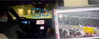
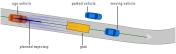

# CommonRoad to Autoware Interface
This interface is used to couple CommonRoad with the planning part of Autoware both in simulation and on 
real vehicles.

Real Test Drive with Inteface

CommonRoad Scenario From Real Drive

## Paper
G. Würsching, T. Mascetta, Y. Lin and M. Althoff: "Simplifying Sim-to-Real Transfer in Autonomous Driving:
Coupling Autoware with the CommonRoad Motion Planning Framework", Proc. of the IEEE Intelligent Vehicles Symposium, 2024.

## Authors
- Gerald Würsching: gerald.wuersching[at]tum.de
- Tobias Mascetta: tobias.mascetta[at]tum.de
